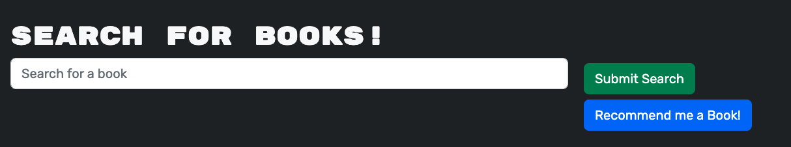

<h1 align="center">📗📘 📙 Book Worms 🐛 🐝 🐞 </h1>

    
    
    
    
    

  

    
    
    
    
    
    
    

## Description
Book Worms is a full-stack MERN application that allows users to search for any books by title and save their favorite books to their collection. It utilizes Google Books API for data retrieval, and uses GraphQL and the Apollo server for data storage and access. It is built with ReactJS for front-end and NodeJS with ExpressJS for back-end. 

## Table of Contents
- [Description](#description)
- [Table of Contents](#table-of-contents)
- [Usage](#usage)
- [Dependencies](#dependencies)
- [Testing](#testing)
- [Contributing](#contributing)
- [Questions](#questions)

# Getting Started 🛫🚀
Vist the deployed application [here:](https://bookwormsglin.herokuapp.com/) and signup or login to get started 

# Usage 🐱‍💻 
When the user visits the website, he/she will be able to search for a book directly, or create an account or login from the upper right-hand side of the screen.

The user does not need to login or create an account to search for a book. To search for a book, simply type in the name of the book in the search bar and click "Submit Search" or hit enter.

To add a book to your collection, simply login, search for a book, and click the "Save this book" button located at the lower left corner of each book result

To remove a book from your collection, click the "See Your Books" button on the upper right hand side of the navbar, then click the "Delete this book!" button to remove the desired book from your collection.

The user can search for more books by clicking the "Search for books" button or logout by clicking the logout button.

# Dependencies 🪵 🧱 

## Front-End
- ReactJS
- Bootstrap
- JavaScript
- Apollo-Client

## Back-End
- GraphQL
- Apollo-Server
- Google Books API
- NodeJS
- ExpressJS
- Mongoose
- MongoDB

## Deployment
- Heroku
- MongoDB Atlas

## Version History
- 1.5 Implemented feature that recommends books to users!
- 
- 1.0 inital Release

# Testing 🧪 

No testing is currently set up 
# Contributing ⚒️

:octocat: [George Lin](https://github.com/lingeorge88)

If you would like to contribute to Book Worms, you can simply fork the repository and create a pull request with your changes. We welcome any contributions, including bug fixes, feature enhancements, and documentation improvements.

# Questions 📬
 

✉️ Contact me with any further questions:  [GitHub](https://github.com/lingeorge88)
